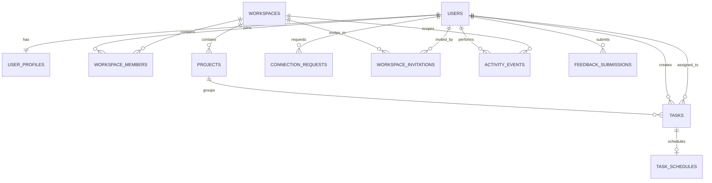

# Orbit Workspace Backend Handoff

This document is the backend contract for the Orbit Workspace frontend. It describes the user workflows, suggested relational tables, API boundaries, and the difference between current browser-only behavior and production behavior.

## Current Frontend Boundary

The app currently has no authentication provider, API routes, or database. `WorkspaceStoreProvider` stores workspace data in the browser's `localStorage` under `orbit-workspace-data`; calendar placements are separately stored under `orbit-task-schedule`; theme selection uses `orbit-theme`.

The frontend currently supports:

- Workspace create, edit, switch, and delete.
- Project create, edit, delete, and project-scoped task lists.
- Task create, edit, complete/reopen, delete, and calendar scheduling with an optional time.
- Profile name, email, role/title, pronouns, bio, availability, and status message.
- Workspace invitation records, connection requests by public Orbit ID, profile activity, and feedback records.
- Workspace preferences for notifications, timezone, week start, and active workspace.

These records are local to one browser. Invitation records do not send email, feedback does not reach a support team, and connection requests do not reach another account. The hard-coded people directory and starter records are demo data and must be replaced by authenticated backend data.

## Public Pages and Theme

- The landing page at `/` has Product, How it works, About, and Pricing sections. Its section links use smooth scrolling and respect reduced-motion preferences.
- `/about` explains the product's purpose and guiding principles. Login and registration are available at `/login` and `/register`.
- A shared theme provider applies the light/dark choice across the public pages and workspace. It follows the operating-system preference until the user chooses a theme, then saves that choice in `localStorage` under `orbit-theme`.
- Login and registration are UI scaffolding only. The workspace Logout link currently navigates to `/`; it does not end an authenticated session because authentication is not yet connected.

## Entity Relationships

## Tables

Use UUID primary keys for internal relations. The public Orbit ID is a separate, human-shareable identifier. Use UTC timestamps (`TIMESTAMPTZ`) and store user timezone preferences separately.

### `users`

Authentication identity and globally unique public lookup ID.

| Column         | Type                                        | Notes                                                                      |
| -------------- | ------------------------------------------- | -------------------------------------------------------------------------- |
| `id`           | UUID, PK                                    | Internal user identifier.                                                  |
| `auth_subject` | TEXT, UNIQUE, NOT NULL                      | Stable subject from the chosen auth provider; do not store passwords here. |
| `public_id`    | TEXT, UNIQUE, NOT NULL                      | Shareable ID such as `ORB-1042`; indexed for exact directory lookup.       |
| `email`        | CITEXT or normalized TEXT, UNIQUE, NOT NULL | Verified account email.                                                    |
| `created_at`   | TIMESTAMPTZ                                 | Defaults to `now()`.                                                       |
| `updated_at`   | TIMESTAMPTZ                                 | Updated on account changes.                                                |
| `deleted_at`   | TIMESTAMPTZ, nullable                       | Optional soft-delete marker.                                               |

### `user_profiles`

User-editable details shown on Profile and in the account menu. `user_id` is both PK and FK to `users.id`.

| Column           | Type           | Notes                                                           |
| ---------------- | -------------- | --------------------------------------------------------------- |
| `user_id`        | UUID, PK/FK    | One-to-one with `users`.                                        |
| `display_name`   | TEXT, NOT NULL | Frontend `name`.                                                |
| `role_title`     | TEXT, nullable | Personal job title; distinct from a workspace permission role.  |
| `pronouns`       | TEXT, nullable | User-entered display detail.                                    |
| `bio`            | TEXT, nullable | Enforce a reasonable length limit, e.g. 500 characters.         |
| `avatar_url`     | TEXT, nullable | Object-storage URL; the current frontend only derives initials. |
| `availability`   | TEXT, NOT NULL | Check constraint: `available`, `away`, `do_not_disturb`.        |
| `status_message` | TEXT, nullable | Short team-visible status.                                      |
| `updated_at`     | TIMESTAMPTZ    | Updated on profile edits.                                       |

### `workspaces`

| Column          | Type                  | Notes                                               |
| --------------- | --------------------- | --------------------------------------------------- |
| `id`            | UUID, PK              | Workspace ID.                                       |
| `name`          | TEXT, NOT NULL        | Workspace display name.                             |
| `description`   | TEXT, nullable        | Workspace purpose.                                  |
| `owner_user_id` | UUID, FK → `users.id` | Initial owner.                                      |
| `created_at`    | TIMESTAMPTZ           |                                                     |
| `updated_at`    | TIMESTAMPTZ           |                                                     |
| `archived_at`   | TIMESTAMPTZ, nullable | Prefer archive over cascading destructive deletion. |

### `workspace_members`

Join table and authorization boundary. Composite PK: (`workspace_id`, `user_id`).

| Column         | Type                       | Notes                                                                                          |
| -------------- | -------------------------- | ---------------------------------------------------------------------------------------------- |
| `workspace_id` | UUID, FK → `workspaces.id` |                                                                                                |
| `user_id`      | UUID, FK → `users.id`      |                                                                                                |
| `role`         | TEXT, NOT NULL             | Check constraint: `owner`, `admin`, `member`, `guest`. This is not `user_profiles.role_title`. |
| `joined_at`    | TIMESTAMPTZ                |                                                                                                |
| `created_at`   | TIMESTAMPTZ                |                                                                                                |

### `user_preferences`

One row per user; PK/FK `user_id` → `users.id`. The current settings screen treats these as user defaults.

| Column                | Type                                | Notes                                                                 |
| --------------------- | ----------------------------------- | --------------------------------------------------------------------- |
| `user_id`             | UUID, PK/FK                         |                                                                       |
| `active_workspace_id` | UUID, nullable FK → `workspaces.id` | Validate that the user is a member of this workspace.                 |
| `email_notifications` | BOOLEAN                             |                                                                       |
| `task_updates`        | BOOLEAN                             |                                                                       |
| `mentions`            | BOOLEAN                             |                                                                       |
| `weekly_digest`       | BOOLEAN                             |                                                                       |
| `timezone`            | TEXT, NOT NULL                      | IANA zone, e.g. `America/Los_Angeles`.                                |
| `week_starts_on`      | SMALLINT or TEXT                    | `1`/`monday` or `0`/`sunday`; choose one representation consistently. |
| `theme`               | TEXT                                | Optional; currently stored separately in browser storage.             |
| `updated_at`          | TIMESTAMPTZ                         |                                                                       |

If notification choices are workspace-specific, move them to a `workspace_preferences` table keyed by `workspace_id` instead of silently treating them as global user choices.

### `projects`

| Column             | Type                                 | Notes                                                                                 |
| ------------------ | ------------------------------------ | ------------------------------------------------------------------------------------- |
| `id`               | UUID, PK                             | Stable ID used by task foreign keys and project routes.                               |
| `workspace_id`     | UUID, FK → `workspaces.id`, NOT NULL | A project belongs to one workspace.                                                   |
| `name`             | TEXT, NOT NULL                       | Unique within a workspace; index (`workspace_id`, normalized `name`).                 |
| `description`      | TEXT, nullable                       |                                                                                       |
| `color`            | TEXT, NOT NULL                       | Store a semantic color token, not a Tailwind class string.                            |
| `due_at`           | DATE, nullable                       |                                                                                       |
| `progress_percent` | SMALLINT, nullable                   | Prefer deriving progress from completed tasks; if manually editable, constrain 0–100. |
| `created_by`       | UUID, FK → `users.id`                |                                                                                       |
| `created_at`       | TIMESTAMPTZ                          |                                                                                       |
| `updated_at`       | TIMESTAMPTZ                          |                                                                                       |
| `archived_at`      | TIMESTAMPTZ, nullable                |                                                                                       |

### `project_members` (optional, recommended for per-project access)

The frontend's starter projects have member initials, but these are not stable user identities. Replace them with this join table if projects can have a subset of workspace members.

| Column       | Type                     | Notes                                    |
| ------------ | ------------------------ | ---------------------------------------- |
| `project_id` | UUID, FK → `projects.id` |                                          |
| `user_id`    | UUID, FK → `users.id`    |                                          |
| `role`       | TEXT, nullable           | Optional project-level role.             |
| `added_at`   | TIMESTAMPTZ              | Composite PK: (`project_id`, `user_id`). |

### `tasks`

| Column         | Type                               | Notes                                                                                             |
| -------------- | ---------------------------------- | ------------------------------------------------------------------------------------------------- |
| `id`           | UUID, PK                           | Stable task ID.                                                                                   |
| `project_id`   | UUID, FK → `projects.id`, NOT NULL | Do not relate tasks by project name.                                                              |
| `title`        | TEXT, NOT NULL                     |                                                                                                   |
| `description`  | TEXT, nullable                     | Useful extension; not currently in the form.                                                      |
| `priority`     | TEXT, NOT NULL                     | Check constraint: `low`, `medium`, `high`.                                                        |
| `status`       | TEXT, NOT NULL                     | Current UI values: Todo, In progress, In review. Add `done` as the canonical completed state.     |
| `due_at`       | DATE, nullable                     | Current seed data also contains labels such as `Today`; normalize these during migration.         |
| `created_by`   | UUID, FK → `users.id`              |                                                                                                   |
| `assignee_id`  | UUID, nullable FK → `users.id`     | Recommended next task workflow; current demo tasks are implicitly assigned to the signed-in user. |
| `completed_at` | TIMESTAMPTZ, nullable              | Set/clear as status changes.                                                                      |
| `position`     | NUMERIC or sortable key            | Optional stable order within a project.                                                           |
| `created_at`   | TIMESTAMPTZ                        |                                                                                                   |
| `updated_at`   | TIMESTAMPTZ                        |                                                                                                   |
| `deleted_at`   | TIMESTAMPTZ, nullable              | Optional soft-delete marker.                                                                      |

The current client stores both `status` and `completed: boolean`. Prefer `status = 'done'` plus `completed_at` in the database, then derive the legacy boolean in API responses until the frontend is migrated.

### `task_schedules`

Calendar scheduling is distinct from a task's deadline. The current calendar allows one scheduled date/time per task, so `task_id` can be unique. Remove that uniqueness if tasks later support multiple sessions.

| Column           | Type                         | Notes                                                                            |
| ---------------- | ---------------------------- | -------------------------------------------------------------------------------- |
| `id`             | UUID, PK                     |                                                                                  |
| `task_id`        | UUID, UNIQUE/FK → `tasks.id` | One schedule entry per task in the current UI.                                   |
| `scheduled_date` | DATE, NOT NULL               | Calendar day.                                                                    |
| `scheduled_time` | TIME, nullable               | Optional local start time.                                                       |
| `timezone`       | TEXT, NOT NULL               | Snapshot of the scheduling timezone, or resolve from user preferences by policy. |
| `created_by`     | UUID, FK → `users.id`        |                                                                                  |
| `created_at`     | TIMESTAMPTZ                  |                                                                                  |
| `updated_at`     | TIMESTAMPTZ                  |                                                                                  |

### `connection_requests`

Keep connection requests separate from workspace invitations. A connection links two user accounts; a workspace invitation grants membership in one workspace.

| Column              | Type                            | Notes                                           |
| ------------------- | ------------------------------- | ----------------------------------------------- |
| `id`                | UUID, PK                        |                                                 |
| `requester_user_id` | UUID, FK → `users.id`, NOT NULL | Authenticated sender.                           |
| `recipient_user_id` | UUID, FK → `users.id`, NOT NULL | Resolved from the recipient's `public_id`.      |
| `status`            | TEXT, NOT NULL                  | `pending`, `accepted`, `declined`, `cancelled`. |
| `created_at`        | TIMESTAMPTZ                     |                                                 |
| `responded_at`      | TIMESTAMPTZ, nullable           |                                                 |
| `updated_at`        | TIMESTAMPTZ                     |                                                 |

Add a check preventing a user from connecting to themselves. Prevent duplicate pending requests for the same unordered user pair; enforce this transactionally so simultaneous requests cannot race.

### `workspace_invitations`

| Column                | Type                                 | Notes                                                             |
| --------------------- | ------------------------------------ | ----------------------------------------------------------------- |
| `id`                  | UUID, PK                             |                                                                   |
| `workspace_id`        | UUID, FK → `workspaces.id`, NOT NULL |                                                                   |
| `email`               | CITEXT or normalized TEXT, NOT NULL  | Invite destination.                                               |
| `role`                | TEXT, NOT NULL                       | `admin`, `member`, or `guest`; validate against workspace policy. |
| `invited_by_user_id`  | UUID, FK → `users.id`, NOT NULL      | Must have permission to invite.                                   |
| `status`              | TEXT, NOT NULL                       | `pending`, `accepted`, `revoked`, `expired`.                      |
| `token_hash`          | TEXT, nullable                       | Store a hash, never a raw invitation token.                       |
| `expires_at`          | TIMESTAMPTZ, nullable                |                                                                   |
| `accepted_by_user_id` | UUID, nullable FK → `users.id`       |                                                                   |
| `created_at`          | TIMESTAMPTZ                          |                                                                   |
| `updated_at`          | TIMESTAMPTZ                          |                                                                   |

Enforce at most one pending invitation per (`workspace_id`, normalized `email`). Sending an invitation should dispatch email only after the record is committed, ideally through an outbox/job.

### `activity_events`

Append-only audit/activity timeline. The frontend currently renders a short action and target label and keeps at most 100 events locally.

| Column          | Type                                | Notes                                                                                     |
| --------------- | ----------------------------------- | ----------------------------------------------------------------------------------------- |
| `id`            | UUID, PK                            |                                                                                           |
| `workspace_id`  | UUID, nullable FK → `workspaces.id` | Null for account-wide activity.                                                           |
| `actor_user_id` | UUID, nullable FK → `users.id`      | Null for system actions.                                                                  |
| `action`        | TEXT, NOT NULL                      | E.g. `task.completed`, `project.created`, `profile.updated`. Prefer stable machine codes. |
| `entity_type`   | TEXT, nullable                      | `task`, `project`, `workspace`, `profile`, `invitation`, etc.                             |
| `entity_id`     | UUID, nullable                      |                                                                                           |
| `summary`       | TEXT, NOT NULL                      | Human-readable target/context.                                                            |
| `metadata`      | JSONB                               | Small non-sensitive details for richer rendering.                                         |
| `created_at`    | TIMESTAMPTZ                         | Index (`actor_user_id`, `created_at DESC`) and (`workspace_id`, `created_at DESC`).       |

Do not put secrets, invitation tokens, or unnecessary personal data in activity metadata.

### `feedback_submissions`

| Column        | Type                                | Notes                                                                  |
| ------------- | ----------------------------------- | ---------------------------------------------------------------------- |
| `id`          | UUID, PK                            |                                                                        |
| `user_id`     | UUID, nullable FK → `users.id`      | Nullable for unauthenticated feedback.                                 |
| `reply_email` | CITEXT or normalized TEXT, nullable |                                                                        |
| `topic`       | TEXT, NOT NULL                      | Current choices: feature request, bug report, account question, other. |
| `message`     | TEXT, NOT NULL                      | Validate length and sanitize on output.                                |
| `status`      | TEXT, NOT NULL                      | `new`, `in_review`, `answered`, `closed`.                              |
| `created_at`  | TIMESTAMPTZ                         |                                                                        |
| `updated_at`  | TIMESTAMPTZ                         |                                                                        |

## API Workflows

All protected routes should derive the actor from the authenticated session, not from a client-supplied `user_id`. Check workspace membership and role on every workspace-scoped request.

| Workflow              | Suggested endpoint                                                                                                                                                                                   | Behavior                                                                                                                                               |
| --------------------- | ---------------------------------------------------------------------------------------------------------------------------------------------------------------------------------------------------- | ------------------------------------------------------------------------------------------------------------------------------------------------------ |
| App bootstrap         | `GET /api/me`                                                                                                                                                                                        | Return current user/profile, preferences, workspace memberships, and active workspace.                                                                 |
| Edit profile          | `PATCH /api/me/profile`                                                                                                                                                                              | Update display name, role title, pronouns, bio, availability, status message, and avatar URL. Record a profile activity event.                         |
| Update preferences    | `PATCH /api/me/preferences`                                                                                                                                                                          | Save notification choices, timezone, week start, theme, and active workspace. Verify active workspace membership.                                      |
| Workspace CRUD        | `GET/POST /api/workspaces`, `GET/PATCH/DELETE /api/workspaces/:id`                                                                                                                                   | List only joined workspaces. Creating makes the caller owner/member. Deletion should archive or require explicit cascade confirmation.                 |
| Members               | `GET/POST/DELETE /api/workspaces/:id/members`                                                                                                                                                        | Enforce role permissions. Invitations create membership only after acceptance.                                                                         |
| Project CRUD          | `GET/POST /api/workspaces/:id/projects`, `GET/PATCH/DELETE /api/projects/:id`                                                                                                                        | Scope every read/write to workspace membership. Renaming a project does not break tasks because tasks reference `project_id`.                          |
| Task CRUD             | `GET/POST /api/projects/:id/tasks`, `GET/PATCH/DELETE /api/tasks/:id`                                                                                                                                | Validate status/priority and workspace membership. Completing sets `status = 'done'` and `completed_at`.                                               |
| Schedule a task       | `PUT/DELETE /api/tasks/:id/schedule`                                                                                                                                                                 | Upsert/remove `task_schedules`; preserve task deadline separately.                                                                                     |
| Find a person         | `GET /api/users?public_id=ORB-2048`                                                                                                                                                                  | Return only safe directory fields; never expose private account data.                                                                                  |
| Connection requests   | `POST /api/connections/requests`, `GET /api/connections/requests`, `POST /api/connections/requests/:id/accept`, `POST /api/connections/requests/:id/decline`, `DELETE /api/connections/requests/:id` | Sender is current user. Recipient must resolve by public ID. Only recipient accepts/declines; sender may cancel pending request.                       |
| Workspace invitations | `POST/GET /api/workspaces/:id/invitations`, `POST /api/invitations/:token/accept`, `DELETE /api/invitations/:id`                                                                                     | Check inviter permission, normalize email, create expiring one-time token, send mail, add `workspace_members` row on accept, and revoke/cancel safely. |
| Activity              | `GET /api/me/activity?cursor=...` or `GET /api/workspaces/:id/activity?cursor=...`                                                                                                                   | Return newest-first, paginated events visible to the actor/member.                                                                                     |
| Feedback              | `POST /api/feedback`                                                                                                                                                                                 | Validate topic/message, store submission, return an ID and received status; connect to an internal support queue separately.                           |

Use pagination for tasks, activity, invitations, and connections. Return structured validation errors (for example `409 duplicate_pending_request`, `403 insufficient_role`, `422 invalid_status`) so the UI can show actionable messages.

## End-to-End Flows

### Sign-in and bootstrap

1. Authenticate using an external identity provider or a secure server-side session.
2. `GET /api/me` returns profile, user preferences, and workspace memberships.
3. The frontend selects the saved active workspace only if the user is still a member; otherwise use the first accessible workspace.
4. Fetch projects/tasks for that workspace. Never trust the browser's cached membership or role as authorization.

### Create workspace, project, and task

1. `POST /api/workspaces` creates a workspace and owner membership in one transaction.
2. `POST /api/workspaces/:id/projects` verifies owner/admin/member permission and creates the project.
3. `POST /api/projects/:id/tasks` creates the task with a stable `project_id`, creator, and optional assignee.
4. Each successful mutation writes an `activity_events` row in the same transaction or through a reliable outbox.
5. Rename operations update display data only; foreign keys remain unchanged. Deletes should default to archive/restrict, not silently remove child tasks.

### Schedule work

1. User selects or drags a task to a calendar date.
2. `PUT /api/tasks/:id/schedule` validates access, date, time, and timezone, then upserts one schedule row.
3. Calendar displays `scheduled_date` and optional `scheduled_time`; task `due_at` remains an independent deadline.
4. Changing week start/timezone updates `user_preferences`, not the schedule's stored date.

### Invite a workspace teammate

1. `POST /api/workspaces/:id/invitations` sends email and role; server verifies the inviter can invite.
2. Server stores a hashed, expiring token and sends a one-time URL through an email provider.
3. Invitee authenticates and accepts the token; in one transaction, mark invitation accepted and create/update `workspace_members`.
4. Revoked, expired, duplicate, or already-member invitations return explicit errors.
5. The current profile form only creates a local pending record. Replace this response with the server-created invitation and delivery state.

### Connect two Orbit users

1. Search an exact public ID with `GET /api/users?public_id=...`.
2. `POST /api/connections/requests` stores current user as requester and matched account as recipient.
3. Recipient sees the request in Inbox and accepts or declines it.
4. Requester may cancel while pending. Prevent self-requests and duplicate/reverse pending requests.
5. Connection requests do not grant workspace membership.

### Activity, profile, and feedback

1. Profile changes use `PATCH /api/me/profile`; activity records the edit without logging sensitive fields.
2. Task/project/invite/connection actions create activity events with actor, entity, action, and timestamp.
3. Activity is read newest-first with a cursor; the frontend can continue displaying an empty state if there is no history.
4. Feedback is submitted to `/api/feedback`; the backend stores it and routes it to support. The current form only stores locally.

## Frontend-to-Backend Mapping Notes

- `WorkspaceProject.workspaceId` → `projects.workspace_id`.
- `Task.projectId` → `tasks.project_id`; `Task.project` is display text and should not be treated as a key.
- `Task.completed` should be derived from canonical task status and `completed_at` after API migration.
- Current due strings include legacy labels such as `Today`, `Tomorrow`, and `Oct 08`; normalize known values to `due_at` and preserve unparseable labels for manual cleanup rather than guessing a date.
- Current project member initials are demo display values. Resolve real members to user IDs before writing `project_members`.
- Current profile invitations store only email, role, status, and time. Production invitations need workspace scope, inviter, secure token lifecycle, expiry, and mail delivery.
- Current connection rows duplicate recipient name/email for demo display. Production requests should reference user IDs; names/emails come from the authorized user lookup.
- Calendar schedule state currently uses one date and optional time per task in local storage. If multi-session planning is required, model schedules as multiple task events instead of enforcing a unique `task_id`.

## Suggested Implementation Order

1. Authentication/session and `users`/`user_profiles`.
2. Workspaces, memberships, authorization checks, and preferences.
3. Projects, tasks, CRUD endpoints, and transaction-safe activity events.
4. Task schedules and calendar endpoints.
5. Connection requests by public Orbit ID.
6. Workspace invitations with email delivery and acceptance.
7. Feedback intake/support routing, then replace frontend local storage with API loading/mutations and loading/error states.
